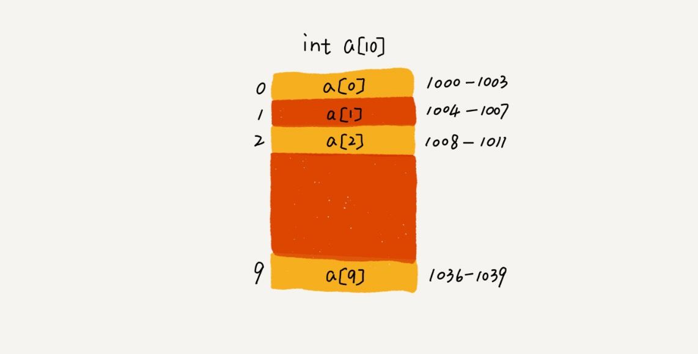
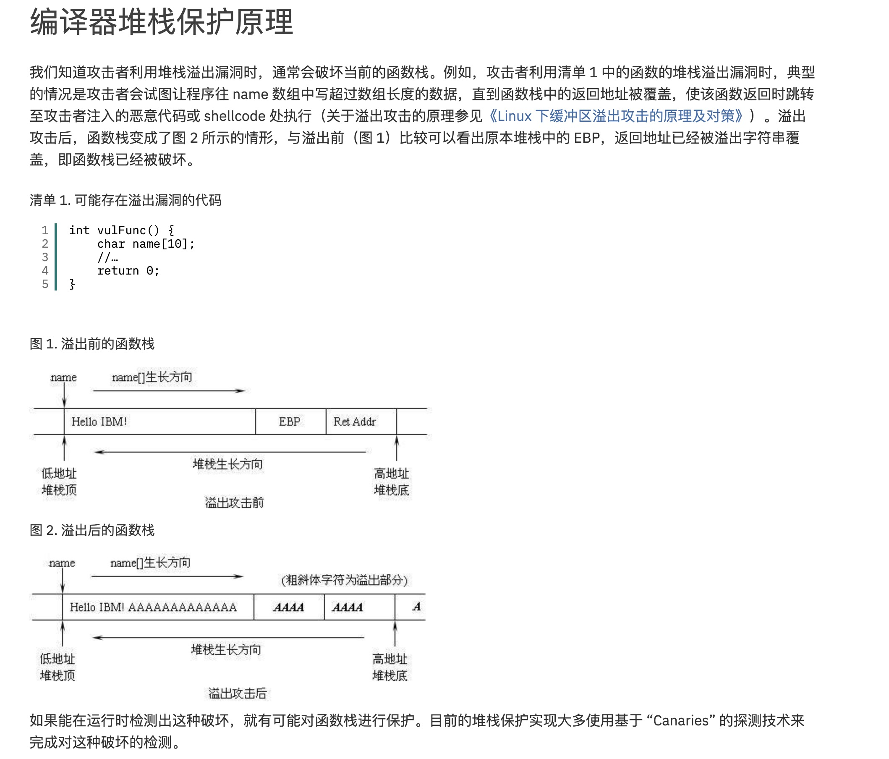

### 数组

#### 数组定义
数组是连续内存空间、相同类型的线性表结构。    

- 连续内存空间   
计算机会给数组分配一个连续的内存空间，通过内存地址查找某index的元素值  

a[i] = a_baseAddress+i*space_size;  
特点：查找某个位置的数据时间复杂度O(1),但是插入和删除数据最坏复杂度都是O(n)  

- 相同类型   
只能存储同一类型数据，方便计算和查找  

- 线性表   
数组、链表、队列、栈都是线性表

#### 容器vs数组   

- 容器支持动态扩容
- 扩容会造成性能浪费
- Java ArrayList 无法存储基本类型，比如 int、long，需要封装为 Integer、Long 类，
而 Autoboxing、Unboxing 则有一定的性能消耗，所以如果特别关注性能，或者希望使用基本类型，就可以选用数组。

#### 思考   

- 二维数组寻址  
address = base_address + ( i * n + j) * type_size  

- 数组溢出问题   
成员变量素组存放在栈内存中，并且是从高低地址向低位地址生长，假如说数组越界并没有进行安全校验会造成数据被覆盖问题  

