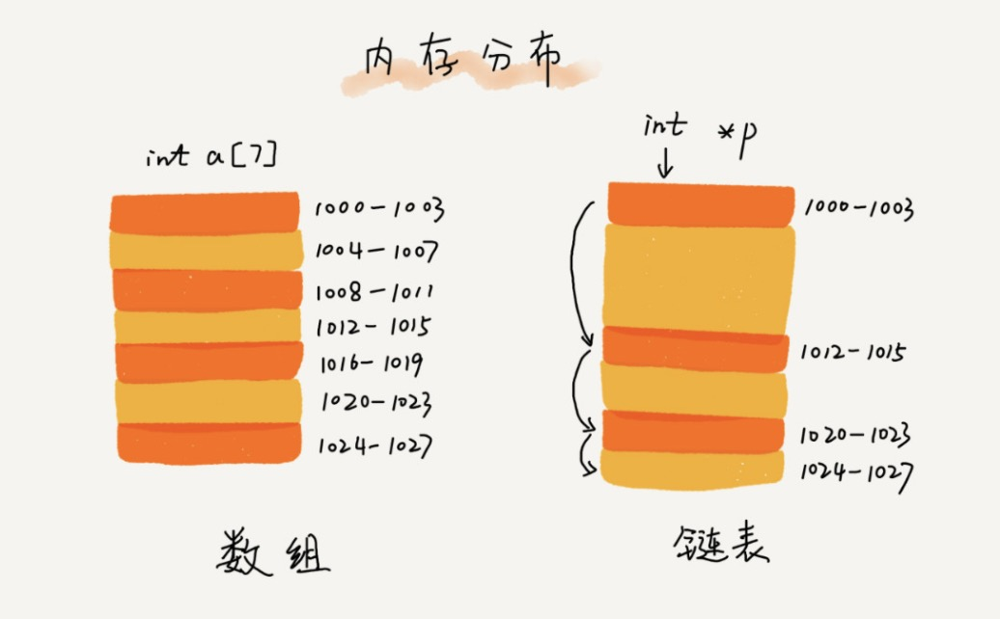

### 链表

#### 链表定义
链表是由一组**不连续的内存空间**构成的**有序**数据集，并且每个节点存储至少一个相邻节点的结构。  

#### 内存分布   
 

#### 特点   
   - 插入：数据不需要移动数据，只需要修改节点指针指向，时间复杂度和空间复杂度都为O(1)   
   - 删除：同插入  
   - 查找：需要重头遍历，时间复杂度O(n)

#### 种类   
单链表、双链表、循环链表 

#### 链表数组对比   
数组是连续内存空间，所以一经申请，大小和指针位置都明确，内存访问速度更快，
但是由于连续空间，当申请内存没有足够多的连续内存存储时就回发生OOM。一定情况下的插入删除比链表慢   
链表是非连续空间，对于内存操作更加灵敏，

在链表中定义一个哨兵节点来代替头节点，这样就不会出现头结点为空的情况，减少了头结点为空的判断

